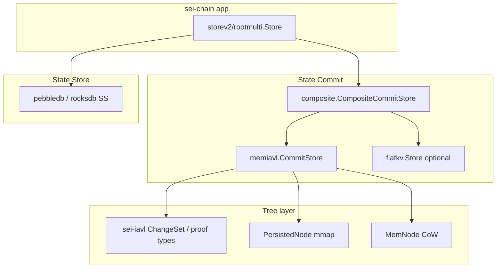
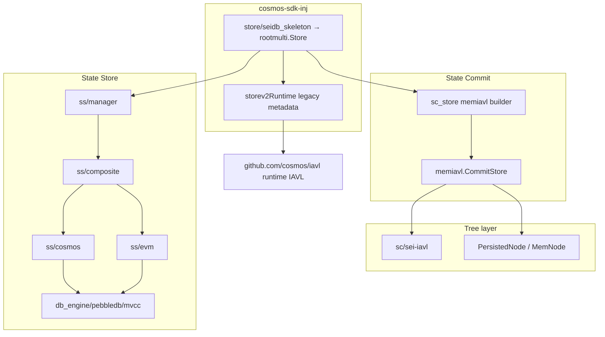

# MemIAVL / sei-iavl：Sei-Chain 与 cosmos-sdk-inj SeiDB 对比

> 更新日期：2026-05-22  
> 对比范围：  
> - **Sei**：`sei-chain/sei-db/state_db/sc/memiavl` + `sei-chain/sei-iavl`  
> - **Injective 移植**：`cosmos-sdk-inj/store/seidb/sc/memiavl` + `cosmos-sdk-inj/store/seidb/sc/sei-iavl`

---

## 1. 结论摘要

| 维度 | 是否一致 | 说明 |
|------|----------|------|
| **MemIAVL 核心算法** | ✅ 基本一致 | `PersistedNode` / `MemNode`、快照 mmap、WAL changelog、后台 `rewriteSnapshot`、CoW `ApplyChangeSet` 等逻辑与 Sei 同源拷贝，非测试 `.go` 仅 import 与少量适配差异 |
| **sei-iavl 树实现** | ✅ 基本一致 | 自 `sei-chain/sei-iavl` rsync 至 `sc/sei-iavl`，变更主要为模块路径与 Cosmos/CometBFT 依赖替换 |
| **SC 上层集成** | ⚠️ 部分一致 | Injective 仅接 **memiavl** SC；Sei 另有 **composite + flatkv**（EVM） |
| **应用接线** | ⚠️ 不同 | Sei 走 `storev2` + `state_db/{sc,ss,db_engine}`；Injective 走 `seidb/rootmulti` 编排层 + `seidb/{sc,ss,db_engine}`，且 **历史 proof / runtime 元数据** 仍保留部分 legacy `github.com/cosmos/iavl` 路径 |
| **配置** | ⚠️ 超集 | Injective `memiavl.Config` 增加 `enable` / `zero-copy` / `cache-size` 及 app.toml 接线；`cache-size` 尚未落到树逻辑 |

**一句话**：SC 内的 **memiavl + sei-iavl 内核与 Sei 对齐**；当前差异主要集中在 **SC 功能广度（无 flatkv SC）** 与 **SDK 侧编排/历史证明接线**，而 `store/seidb` 目录层次已基本对齐 `sei-db` 的 `sc / ss / db_engine` 形态。

---

## 2. 目录与代码映射

### 2.1 MemIAVL（State Commit）

| Sei 路径 | cosmos-sdk-inj 路径 | 关系 |
|----------|---------------------|------|
| `sei-db/state_db/sc/memiavl/*.go` | `store/seidb/sc/memiavl/*.go` | 1:1 拷贝 + 适配 |
| `sei-db/common/{errors,utils,log}` | `store/seidb/sc/common/{errors,utils,log}` | 拆到 `sc/common` |
| `sei-db/proto/`（changelog 等） | `store/seidb/sc/proto/` | 拆到 `sc/proto` |
| `sei-db/wal/` | `store/seidb/sc/wal/` | 拆到 `sc/wal` |
| `sei-iavl` | `store/seidb/sc/sei-iavl` | 见下节 |

### 2.1.1 SS / DB Engine 目录对齐（已完成）

| Sei 路径 | cosmos-sdk-inj 路径 | 关系 |
|----------|---------------------|------|
| `sei-db/state_db/ss/composite/` | `store/seidb/ss/composite/` | 结构对齐 |
| `sei-db/state_db/ss/cosmos/` | `store/seidb/ss/cosmos/` | 结构对齐 |
| `sei-db/state_db/ss/evm/` | `store/seidb/ss/evm/` | 结构对齐 |
| `sei-db/state_db/ss/pruning/` | `store/seidb/ss/pruning/` | 结构对齐 |
| `sei-db/state_db/ss/store.go` | `store/seidb/ss/manager.go` | SS 入口 / builder |
| `sei-db/db_engine/pebbledb/mvcc/` | `store/seidb/db_engine/pebbledb/mvcc/` | 结构对齐 |
| `sei-db/common/evm/` | `store/seidb/common/evm/` | 结构对齐 |
| `sei-db/config/*` | `store/seidb/config/*` | 共享配置层 |

**仅 Sei 存在（Injective 未移植）**

| 路径 | 作用 |
|------|------|
| `sei-db/state_db/sc/composite/` | Cosmos memiavl + EVM flatkv 组合提交 |
| `sei-db/state_db/sc/flatkv/` | EVM 专用 SC（LatticeHash 等） |
| `sei-db/state_db/SC_SS_ARCHITECTURE.md` | SC/SS 生命周期文档 |
| `memiavl/SNAPSHOT_MEMNODE_LIFECYCLE.md` | MemNode 快照泄压说明 |

### 2.2 sei-iavl（变更集 / 证明语义）

| Sei 路径 | cosmos-sdk-inj 路径 |
|----------|---------------------|
| `sei-chain/sei-iavl/` | `store/seidb/sc/sei-iavl/` |

拷贝时排除：`benchmarks/`、`cmd/`、`testdata/`。测试文件在 Injective 侧多数标记 `//go:build ignore`（mock 仍基于旧 `tm-db` 接口）。

---

## 3. 架构对比

### 3.1 Sei-Chain（生产路径）



- **Deliver**：`commitment.Store` 只累积 `iavl.ChangeSet`，不改树。  
- **Commit**：`memiavl.ApplyChangeSets` → IAVL CoW → 周期性快照落盘 → 释放 MemNode。  
- **配置**：`app.toml` `[state-commit]`，`sc-*` 前缀（见 `sei-chain/app/seidb.go`）。

### 3.2 cosmos-sdk-inj SeiDB（当前）



- **SC 读**：`commitment.Store` → `memiavl.Tree`（mmap + MemNode）。  
- **SC 写**：块末 changeset → `memIAVLStore.ApplyChangeSets` → `Commit`。  
- **SS**：已拆成 `ss/composite`、`ss/cosmos`、`ss/evm`、`ss/pruning`，底层为 `db_engine/pebbledb/mvcc`。  
- **AppHash / 历史 proof / 部分元数据路径**：仍保留 legacy runtime IAVL 参与（见 §6、§9.3）。  
- **仍无** `SC flatkv` / `SC composite`。

---

## 4. MemIAVL 文件级差异

对顶层非测试 `.go` 做 diff 后的结论：

| 文件 | 实质性差异 | 说明 |
|------|------------|------|
| `config.go` | ✅ 有 | Injective 增加 `Enable`、`ZeroCopy`、`CacheSize` 及默认值 |
| `store.go` | ✅ 有 | `ZeroCopy: config.ZeroCopy`（Sei 写死 `false`） |
| `proof.go` | 仅依赖 | `confio/ics23` → `cosmos/ics23`；`sei-iavl` import 路径 |
| `tree.go` | 仅依赖 | `sei-iavl`、`utils`、`types` 路径 |
| `db.go` / `multitree.go` / `snapshot.go` / `persisted_node.go` 等 | 仅依赖 | WAL、proto、errors、sei-iavl 包路径替换 |

**核心不变部分（与 Sei 一致）**

- `mem_node.go` / `persisted_node.go`：MemNode 物化、PersistedNode mmap 导航  
- `snapshot.go`：快照格式、pipeline、prefetch、rate limit  
- `multitree.go`：`ApplyChangeSets`、`Commit`、`rewriteSnapshotBackground`  
- `db.go`：changelog WAL、`OpenDB`、catch-up replay  
- `export.go` / `import.go`：state-sync 树导入导出  

---

## 5. sei-iavl 差异

### 5.1 依赖替换

| 类别 | Sei | cosmos-sdk-inj |
|------|-----|----------------|
| 模块路径 | `github.com/sei-protocol/sei-chain/sei-iavl` | `cosmossdk.io/store/seidb/sc/sei-iavl` |
| DB | `github.com/tendermint/tm-db` | `github.com/cosmos/cosmos-db` |
| 日志 | `github.com/sei-protocol/seilog` | `cosmossdk.io/store/seidb/sc/common/log` |
| ICS23 | `github.com/confio/ics23/go` | `github.com/cosmos/ics23/go` |
| ProofOp proto | `sei-tendermint/.../crypto` | `cometbft/api/cometbft/crypto/v1` |

### 5.2 逻辑差异

对 `mutable_tree.go`、`nodedb.go`、`immutable_tree.go`、`diff.go` 等：**无业务逻辑改动**（仅 import / 日志 shim）。

`proof_iavl_value.go` / `proof_iavl_absence.go`：CometBFT v1 API 路径调整，Proof 编解码行为与 Sei 一致。

### 5.3 测试

| 项 | Sei | Injective |
|----|-----|-----------|
| 包测试 | 默认参与 `go test` | 根包 `*_test.go` 多为 `//go:build ignore` |
| 子包 | 正常 | `cache/`、`internal/*` 仍可测 |

---

## 6. SeiDB 集成层差异（rootmulti / commitment / ss）

| 能力 | Sei `storev2` / `sei-db` | cosmos-sdk-inj `seidb/rootmulti` |
|------|---------------|----------------------------------|
| SC 构造 | `composite.NewCompositeCommitStore` 或直连 memiavl | `RegisterSCStoreBuilder("memiavl")` → `memIAVLStore` |
| EVM SC | flatkv + WriteMode/ReadMode | ❌ 未实现 |
| SS 构造 | `state_db/ss/composite` + `db_engine/pebbledb/mvcc` | `ss/manager` + `ss/composite` + `db_engine/pebbledb/mvcc` |
| SS 写模型 | WAL → async queue → background MVCC write | ✅ 已实现同类 async pipeline |
| SS 读模型 | `cosmos/evm/composite` 路由 | ✅ 已实现同类目录与路由 |
| Deliver KV | `commitment.Store` + memiavl Tree | 同左（已接 sei-iavl ChangeSet） |
| 历史证明 | SC 快照 + SS | SS 历史读已对齐；proof 仍部分回退 runtime |
| InterBlockCache | storev2 对 memiavl 多为 noop | 仍可对 runtime IAVL 生效 |
| AppHash 来源 | 以 SC `CommitInfo` 为主 | ✅ memiavl 激活时已切 SC；legacy metadata 仍存在 |

关键 Injective 文件：

- `rootmulti/sc_store.go` — SC 注册表  
- `rootmulti/sc_memiavl_store.go` — `CommitStore` 包装  
- `commitment/store.go` — Deliver 只写 changeset  
- `ss/manager.go` — SS 统一入口  
- `ss/composite/store.go` — SS 组合路由  
- `db_engine/pebbledb/mvcc/db.go` — SS MVCC 引擎  
- `rootmulti/storev2_runtime.go` — legacy metadata / historical proof fallback

---

## 7. 配置对比

### 7.1 Sei `[state-commit]`（节选）

```toml
[state-commit]
sc-enable = true
sc-zero-copy = false          # app.toml 有，Go 未接（与 Injective 旧版相同问题）
sc-async-commit-buffer = 100
sc-keep-recent = 1
sc-snapshot-interval = 1000
sc-cache-size = 1000          # app.toml 有，Go 未接
```

绑定：`sei-chain/app/seidb.go` → `config.StateCommitConfig.MemIAVLConfig`。

### 7.2 Injective `[memiavl]`

```toml
[memiavl]
enable = false
zero-copy = false
async-commit-buffer = 100
snapshot-keep-recent = 0
snapshot-interval = 10000
cache-size = 1000             # 已进 Config，树内未实现
# 另有 snapshot-min-time-interval、snapshot-writer-limit 等
```

绑定：

- `server/config/toml.go` 模板  
- `store/memiavl_options.go` + `server/util.go` `GetStoreConfig`  
- CLI：`--memiavl.*` / `seidb.enabled`

| 配置项 | Sei memiavl.Config | Injective memiavl.Config | 是否生效 |
|--------|-------------------|--------------------------|----------|
| enable | 用 `sc-enable` | `memiavl.enable` | Injective ✅ |
| zero-copy | 未接 Go | `zero-copy` | Injective ✅（`NewCommitStore`） |
| async-commit-buffer | ✅ | ✅ | ✅ |
| snapshot-keep-recent | ✅ | ✅ | ✅ |
| snapshot-interval | ✅ | ✅ | ✅ |
| cache-size | 未接 Go | 字段有，逻辑无 | ❌ 双方均未实现树缓存 |
| snapshot-min-time-interval 等 | ✅ | ✅ | ✅ |

---

## 8. 数据流对照（Deliver / Commit）

与 Sei [`SC_SS_ARCHITECTURE.md`](../../../../sei-chain/sei-db/state_db/SC_SS_ARCHITECTURE.md) 对齐的部分：

```
Deliver:  App → cachekv → commitment.Store → memiavl.Tree.Get (PersistedNode/MemNode)
          Set/Delete → 仅 changeSet，不改 IAVL

Commit:   changeSets → memiavl.MultiTree.ApplyChangeSets → SaveVersion (CoW)
          → WAL changelog → 可选 async buffer
          → 每 N 块 snapshot rewrite → MemNode 泄压

SS:       同版本 changeset → ss/composite → ss/cosmos|ss/evm
          → db_engine/pebbledb/mvcc ApplyChangeSets
          → WAL + async queue + background MVCC write（与 SC 并行，不参与 Merkle）
```

Injective 与上述 **SC 路径一致**；SS 目录层次与主数据流也已基本对齐。  
当前主要差异在 **SC 无 flatkv/composite**、以及 **历史 proof / 部分元数据仍保留 runtime cosmos/iavl fallback**。

---

## 9. Tree 层：mmap + MemNode CoW（与 Sei 对齐说明）

### 9.1 结论：**可以，且 SC 路径已是该模式**

`memiavl.Tree` 与 Sei 相同，不依赖磁盘上的 `sei-iavl.MutableTree` 做 Deliver 热路径：

| 节点类型 | 存储 | 读路径 | 写路径（Commit） |
|----------|------|--------|------------------|
| **PersistedNode** | 快照目录 mmap（`snapshot-<h>/`） | `Get`/`Iterator` 零拷贝或 clone | 只读，快照 rewrite 后替换 |
| **MemNode** | Go 堆 | CoW 分支共享未改子树 | `setRecursive` / `removeRecursive` + `cowVersion` |

Deliver：`commitment.Store` 只追加 `sei-iavl.ChangeSet`，**不改树**。  
Commit：`memiavl.MultiTree.ApplyChangeSets` → `Tree.SaveVersion` → 在修改路径上 materialize **MemNode**。

### 9.2 与 Sei 对齐的接线（cosmos-sdk-inj 已实现）

启用 `memIAVLStore`（`seidb` + `sc-backend=memiavl`）时：

1. **`rebuildCommitStores`**：IAVL 模块一律 `commitment.NewStore(memiavl.Tree)`，**不再** `LegacyNewStore` 回退到 runtime IAVL。
2. **`GetCommitKVStore`**：IAVL 模块只走 `ckvStore` 中的 memiavl 树；**不**再回退 `runtime.GetCommitKVStore`。
3. **`commitment.Store.Set/Delete`**：底层为 `memiavl.Tree` 时**仅**写 changeset（与 `sei-cosmos/storev2/commitment` 一致）；仅 **Legacy 适配器**（Phase A）仍双写 runtime IAVL。

### 9.3 Phase B（AppHash 切 SC，已实现）

启用 `memIAVLStore`（`seidb` + `sc-backend=memiavl` + `Home`）时：

| 项 | 行为 |
|----|------|
| `Commit()` / `LastCommitID()` / `WorkingHash()` | 以 memiavl SC `CommitInfo` 为准；`runtime.SyncCommitMetadata` 只写元数据，**不**提交 legacy cosmos/iavl |
| `Load*` / `Rollback` | `LoadVersionForSCBackedCommit`：元数据按 SC 高度加载，legacy IAVL 树保持 v0 占位 |
| 无 `Home` 的 noop SC | 回退 Phase A：`runtime.Commit()` 决定 AppHash |

仍与 Sei 不同：历史证明部分高度仍走 `runtime.Query`；无 SC flatkv/composite。

---

## 10. 已知差距与后续建议

| 优先级 | 项 | 说明 |
|--------|-----|------|
| P0 | AppHash 完全切 SC | ✅ Phase B：`rootmulti` 在 memiavl 激活时以 SC 为准（见 §9.3） |
| P1 | `cache-size` 实现或文档标注废弃 | 与 Sei `sc-cache-size` 同理，需 LRU 设计 |
| P1 | 拷贝 `SNAPSHOT_MEMNODE_LIFECYCLE.md` | 便于运维/开发理解泄压 |
| P2 | runtime `store/iavl` 改包 sei-iavl | 统一证明与 Export/Import 类型 |
| P2 | SC composite + flatkv | 仅当 Injective 需要 EVM SC 分裂时移植 |
| P3 | 恢复 sei-iavl 全量测试 | 为 `cosmos-db` 重新生成 mock |

---

## 11. 验证方式

```bash
# 对比 memiavl（应主要为 import 差异）
diff -ru sei-chain/sei-db/state_db/sc/memiavl cosmos-sdk-inj/store/seidb/sc/memiavl

# 对比 sei-iavl
diff -ru sei-chain/sei-iavl cosmos-sdk-inj/store/seidb/sc/sei-iavl \
  --exclude benchmarks --exclude cmd --exclude testdata

# Injective 测试
cd cosmos-sdk-inj/store && go test -tags pebbledb ./seidb/...
```

---

## 12. 参考文件索引

**Sei**

- `sei-chain/sei-db/state_db/sc/memiavl/`  
- `sei-chain/sei-iavl/`  
- `sei-chain/sei-db/state_db/sc/composite/store.go`  
- `sei-chain/sei-cosmos/storev2/rootmulti/store.go`  
- `sei-chain/app/seidb.go`  

**cosmos-sdk-inj**

- `store/seidb/sc/memiavl/`  
- `store/seidb/sc/sei-iavl/`  
- `store/seidb/ss/composite/`  
- `store/seidb/ss/cosmos/`  
- `store/seidb/ss/evm/`  
- `store/seidb/db_engine/pebbledb/mvcc/`  
- `store/seidb/rootmulti/sc_memiavl_store.go`  
- `store/seidb/rootmulti/store.go`  
- `store/seidb/commitment/store.go`  
- `store/memiavl_options.go`  
- `server/util.go` (`GetStoreConfig`, `AddMemIAVLFlags`)
